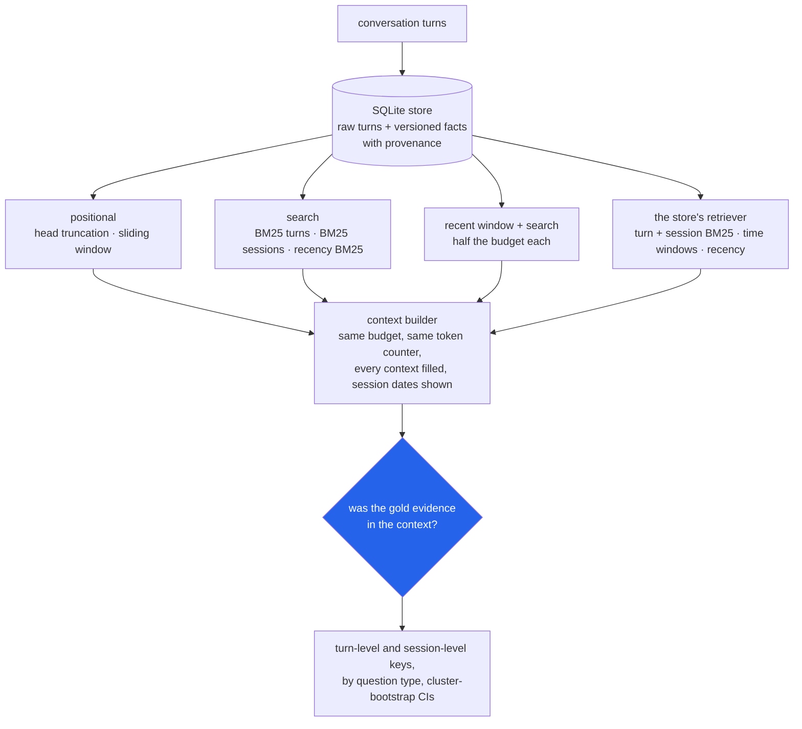

<h1 align="center">agent-memory (Python · SQLite · BM25 · Ollama)</h1>
<p align="center"><i>A cross-session memory layer for agents, and a measurement of what "remember everything and search" actually finds, question type by question type</i></p>

<p align="center">
  <a href="#the-through-line">The through-line</a> &middot;
  <a href="#findings">Findings</a> &middot;
  <a href="#input--output">Input / Output</a> &middot;
  <a href="#quick-start">Quick start</a> &middot;
  <a href="#data">Data</a> &middot;
  <a href="#what-this-does-not-do">What it does NOT do</a> &middot;
  <a href="#problems-hit-while-building-this">Problems hit</a>
</p>

<p align="center">
  
  
  
  
  <a href="LICENSE"></a>
</p>

Inspired by [claude-mem](https://github.com/thedotmack/claude-mem), [mem0](https://github.com/mem0ai/mem0) and [supermemory](https://github.com/supermemoryai/supermemory); no code from them is used.

---

## The through-line



The library is a memory store for agents: ingest conversation turns, keep every raw turn
with its timestamp, file extracted facts as versioned `(subject, attribute, value)` rows
where a newer value supersedes the old one without deleting it, answer "what was true on
date X", retrieve with BM25 written from scratch, and build a context that fits a token
budget. The study puts nine memory strategies through the same context builder on two
benchmarks with gold evidence labels - LoCoMo (10 conversations, 1,986 questions) and
LongMemEval_S (500 questions, each with its own ~112k-token chat history) - and asks
whether the evidence a question needs made it into a 2,048-token context.

> **Searching everything beats a recent-turns window by 67-79 recall points at 2,048
> tokens, and the window does no better than random turns. The control shows why: on
> LoCoMo the window finds 87% of the evidence that sits in the newest tenth of a history
> (BM25: 73%) and almost none anywhere else - and only 7-10% of these benchmarks'
> questions have their evidence there. Even the hybrid agents use - half the budget for
> recent turns, half for search - loses 4-5 points to search alone. What retrieval
> structurally loses is information spread across turns (multi-hop: all evidence found for
> only 34% / 50% of questions) or never named by the question (open-domain: 58% of its
> evidence turns share no content word with it).**

The model arm - LLM fact extraction, `nomic-embed-text` hybrid retrieval, and answer
accuracy with `qwen2.5:14b-instruct` - is built, tested with fakes, and queued; none of
the numbers below needed a model. See [STATUS.md](STATUS.md).

## Findings

All strategy numbers are on the **test split** at a **2,048-token** context, with 95%
cluster-bootstrap intervals; the diagnostics (evidence position, lexical visibility,
answer location) describe all questions. The test split is 1,401 of LoCoMo's 1,986 questions (7 of
its 10 conversations - LoCoMo is split and resampled by conversation, so its intervals
rest on 7 independent histories) and 406 of LongMemEval's 500 (split by question, with
each question and its `_abs` twin kept together). Recall is **turn-level** (the share of
gold evidence turns in context) unless a row says session-level. Every number comes
from [`results/`](results/).

| | Question | Answer on this run | Source |
|---|---|---|---|
| 1 | **Does remembering everything and searching beat recency?** | Yes: BM25 over turns minus a sliding window is **+0.670** recall [0.645, 0.699] on LoCoMo and **+0.788** [0.751, 0.823] on LongMemEval. Both fill the budget (2,047 vs 2,040 / 2,028 tokens on average). The window against random turns: +0.019 [0.001, 0.035] on LoCoMo, −0.016 [−0.032, 0.000] on LongMemEval - no better than chance on either. | `retrieval.json` → `comparisons` |
| 2 | **Is that because the evidence is old?** | Tested, not assumed. Recall of evidence turns by their position in the history (1.0 = the last turn): on LoCoMo the window finds **0.868** [0.752, 0.951] of evidence in the newest tenth, beating BM25's 0.729 [0.673, 0.783] there, and ≤0.010 in every older bucket. On LongMemEval a 2,048-token window covers under 2% of a 112k-token history, so even the newest tenth gets 0.057. Only 9.5% (LoCoMo) and 6.7% (LongMemEval) of questions have their evidence in the newest tenth - a property of these benchmarks, not of agents in general. | `retrieval.json` → `by_evidence_position`; `diagnostics.json` → `evidence_position` |
| 3 | **What about recent turns *plus* search?** | Half the budget for the latest turns, half for BM25, loses to BM25 alone by **0.036** [0.030, 0.045] on LoCoMo and **0.052** [0.029, 0.076] on LongMemEval. It wins the newest bucket on LoCoMo (0.904 vs 0.729) and pays for it in every older one. | `retrieval.json` → `comparisons`, `by_evidence_position` |
| 4 | **Which question types does retrieval structurally lose?** | Multi-hop and inference. The store's recall is 0.905 single-hop / 0.597 multi-hop / 0.446 open-domain on LoCoMo; 0.955 single-hop / 0.680 multi-hop / 0.632 preference on LongMemEval. For multi-hop, *all* evidence turns arrive for only **34%** [22, 43] and **50%** [41, 60] of questions (52% [42, 62] on the LongMemEval questions whose turn key is complete). Open-domain questions ("would Caroline likely...") are lexically invisible: **58% of their 208 evidence turns** share no content word with the question, and **40% of the 92 questions** have no evidence turn that does. | `retrieval.json` → `by_budget`, `subsets`; `diagnostics.json` → `lexical_visibility` |
| 5 | **Are temporal questions lost?** | Not at retrieval: 0.860 [0.800, 0.924] and 0.815 [0.744, 0.883]. But **71%** of LoCoMo's temporal answers are dates the evidence turn never states ("I went to a support group *yesterday*" → gold "7 May 2023"); they are recoverable only because the context builder heads each session with its date. | `diagnostics.json` → `answer_location` |
| 6 | **Knowledge updates: does search return the stale value?** | With BM25 over turns at 2,048 tokens, rarely - the newest value's session is in context for **92%** of update questions and only the stale one for 4.9%. At 512 tokens the stale-only rate is **16.4%**. A 30-day recency half-life cuts that to 6.6% and raises newest-value recall by 6.6 points [0.0, 14.8] - while costing LoCoMo 28 recall points at the same budget (0.608 → 0.325). The dev sweep chose a 5-year half-life: effectively off. | `recency_sensitivity.json` |
| 7 | **What does the store's retriever add over plain BM25?** | +0.071 [0.057, 0.083] on LoCoMo, +0.021 [0.005, 0.038] on LongMemEval (turn level). The ablations put almost all of it on **session-level fusion** (+0.068 / +0.022). Recency decay adds nothing (+0.001 / +0.000). The time-window boost: +0.004 [0.001, 0.007] on LoCoMo and −0.003 [−0.008, 0.000] on LongMemEval overall; on the 95 LoCoMo questions that name a time it is +0.063 [0.024, 0.100], on the 50 LongMemEval ones −0.020 [−0.060, 0.000]. At session level the store is *slightly worse* than BM25 on LoCoMo (−0.019 [−0.030, −0.009]): fusion concentrates the budget on fewer sessions. | `retrieval.json` → `comparisons`, `session_level_comparisons`, `time_expression_questions` |
| 8 | **Recall@k flatters coarse units** | BM25 over whole sessions reaches recall@10 of **0.956** on LongMemEval - at a mean of 29,401 tokens. At an equal 2,048-token budget it is **15 points worse** than BM25 over turns (−0.152 [−0.193, −0.111]). On LoCoMo, where sessions are short, sessions win by 0.022 [0.005, 0.037]. | `retrieval.json` → `by_k`, `comparisons` |
| 9 | **Forgetting: what can be thrown away?** | Truncating every turn to 128 tokens keeps 37% of LongMemEval's stored tokens, drops no evidence turn, and *raises* the store's recall from 0.819 to 0.886 (cheaper turns, more of them fit) - but the literal gold answer survives the cut in 95% of the questions where it was literal, not 100%. Dropping every assistant turn keeps 13% of the tokens and leaves the average almost unchanged (0.813 vs 0.819) by swapping types: multi-hop rises 0.680 → 0.884 while assistant-side questions collapse 0.933 → 0.089. | `forgetting.json` |

What the two answer keys say, and what the data-quality checks changed:

- **Session-level recall** (was any turn of each gold answer session in context?) is
  reported beside turn-level recall for every cell. It is a lenient key - random turns
  score 0.777 on it on LoCoMo because 2,048 tokens of random turns touch most sessions -
  so it is a check on the turn key, not a replacement. LongMemEval needs it: 62 questions
  (30 abstention, 20 temporal, 10 multi-session, 2 knowledge-update) have an answer
  session with no turn marked `has_answer`, so their turn key is incomplete.
- **Findings 1, 3 and 8 survive both LongMemEval data problems.** Without the 76
  questions whose histories contain sessions dated after the question, BM25 minus the window is +0.764 [0.722, 0.805] and the store minus
  BM25 +0.023 [0.005, 0.043]. On the questions with a complete turn key the store's
  recall is 0.839 (vs 0.819 on all).

Two things the headline is not:

- **Not answer accuracy.** Evidence in context is necessary, not sufficient; whether
  `qwen2.5:14b-instruct` answers correctly from it is the queued model arm.
- **Not a tuned leaderboard number.** The store's knobs were chosen on the dev split only
  ([`results/dev_sweep.json`](results/dev_sweep.json), 72 configurations, macro-averaged
  over the two datasets). On LongMemEval's dev split the winner is slightly worse than
  dropping session fusion (0.873 vs 0.888); on LoCoMo's it is much better (0.839 vs 0.735).

## Input / Output

`uv run python demo.py` - real output, unedited, from a fresh run.

**1. A store with known answers** (a lookup, a time-scoped question, a fact that changes,
a forgetting pass):

```
PART 1 - a store with known answers
  ingested 8 turns from 4 sessions
  [ok  ] search 'what is my dog called?': 'jan:1'
  context 'where did I say I work, back in March?' (60-token budget):
      [session mar - 2024-03-05 18:00 (Tuesday)]
      user: Work at Riverside Hospital is exhausting, twelve-hour nursing shifts.
  [ok  ] the March turn is first in context: 'mar:0'
  [ok  ] tokens used <= budget: True
  [ok  ] current employer: "St Mary's clinic"
  [ok  ] employer as of 2024-04-01: 'Riverside Hospital'
  [ok  ] old value kept, marked superseded: 2
  [ok  ] forget phatic turns ('Hi!', 'ok thanks'): 2
  stats: {'sessions': 4, 'turns': 6, 'forgotten_turns': 2, 'facts_current': 1, 'facts_superseded': 1}
```

**2. A LoCoMo temporal question** - found by search, invisible to the window, and
answerable only through the session date (the turn says "yesterday"):

```
  [locomo / temporal] When did Caroline go to the LGBTQ support group?
  gold answer: 7 May 2023
  gold evidence conv-26:D1:3 (08 May 2023) Caroline: I went to a LGBTQ support group yesterday and it was so powerful.
    sliding_window   2047 tokens, evidence turns 0/1, answer sessions 0/1
    bm25_turns       2045 tokens, evidence turns 1/1, answer sessions 1/1
    window_bm25      2045 tokens, evidence turns 1/1, answer sessions 1/1
    store            2041 tokens, evidence turns 1/1, answer sessions 1/1
```

**3. A LoCoMo multi-hop question** - the structural loss. Four activities in four turns
across three sessions; the question's words ("activities", "partake") appear in none of
them, so every strategy finds at most one:

```
  [locomo / multi-hop] What activities does Melanie partake in?
  gold answer: pottery, camping, painting, swimming
  gold evidence conv-26:D1:12 (08 May 2023) Melanie: You'd be a great counselor! Your empathy and understanding will really help the people you
  gold evidence conv-26:D1:18 (08 May 2023) Melanie: Yep, Caroline. Taking care of ourselves is vital. I'm off to go swimming with the kids. Ta
  gold evidence conv-26:D5:4 (03 Jul 2023) Melanie: Wow, Caroline! That's great! I just signed up for a pottery class yesterday. It's like the
  gold evidence conv-26:D9:1 (17 Jul 2023) Melanie: Hey Caroline, hope all's good! I had a quiet weekend after we went camping with my fam two
    sliding_window   2047 tokens, evidence turns 0/4, answer sessions 0/3
    bm25_turns       2038 tokens, evidence turns 1/4, answer sessions 3/3
    window_bm25      2038 tokens, evidence turns 1/4, answer sessions 3/3
    store            2034 tokens, evidence turns 1/4, answer sessions 3/3
```

*The session key calls this 3/3 while only one of the four evidence turns is present -
other turns of the same sessions matched "Melanie". That is why session-level recall is
reported as a check on the turn key, not as the headline.*

**4. A LoCoMo adversarial (abstention) question** - it pins Melanie's charity race on
Caroline. The gold answer is "not answerable"; the evidence is the turn that shows whose
race it was:

```
  [locomo / abstention] What did Caroline realize after her charity race?
  gold answer: Not answerable - the conversation does not say this about them (the trap answer would be: self-care is important)
  gold evidence conv-26:D2:3 (25 May 2023) Melanie: Thanks, Caroline! The event was really thought-provoking. I'm starting to realize that sel
    sliding_window   2047 tokens, evidence turns 0/1, answer sessions 0/1
    bm25_turns       2037 tokens, evidence turns 1/1, answer sessions 1/1
    window_bm25      2047 tokens, evidence turns 1/1, answer sessions 1/1
    store            2043 tokens, evidence turns 1/1, answer sessions 1/1
```

**5. A LongMemEval knowledge-update question** (the first in the file) - the personal best
changed a week later; search finds both sessions, including the newest value:

```
  [longmemeval / knowledge-update] What was my personal best time in the charity 5K run?
  gold answer: 25 minutes and 50 seconds (or 25:50)
  gold evidence 6a1eabeb:answer_a25d4a91_1:4 (23 May 2023) user: That's really helpful, thanks! I've been doing some running lately, and I'm happy to say t
  gold evidence 6a1eabeb:answer_a25d4a91_2:0 (30 May 2023) user: I'm training for another charity 5K run coming up and I was wondering if you could give me
    sliding_window   2047 tokens, evidence turns 0/2, answer sessions 0/2, newest value found: False
    bm25_turns       2034 tokens, evidence turns 2/2, answer sessions 2/2, newest value found: True
    window_bm25      2029 tokens, evidence turns 2/2, answer sessions 2/2, newest value found: True
    store            2042 tokens, evidence turns 2/2, answer sessions 2/2, newest value found: True
```

**6. The CLI on a real LoCoMo conversation** - ingest, search, a time-scoped context,
versioned facts:

```
$ agent-memory --db cli.db ingest --format locomo --pick conv-30 data/raw/locomo10.json
ingested 369 new turns from 19 sessions (0 skipped: already stored)

$ agent-memory --db cli.db search "opening a dance studio" -k 2 --now 2023-07-01
2023-06-19 10:04  conv-30:D15:3  Jon: Thanks, Gina. Still working on opening a dance studio.
2023-06-19 10:04  conv-30:D15:4  Gina: When are you opening the studio?

$ agent-memory --db cli.db context "what did Jon say about his dance studio in June 2023?" --budget 200 --now 2023-07-25
[session conv-30:S8 - 2023-04-03 13:26 (Monday)]
Jon: Gina, good luck with your store! [shares a photo: a photo of a dress with a sign on it that says june bunty]
[session conv-30:S13 - 2023-06-13 20:29 (Tuesday)]
Jon:  I'm prepping for my dance studio more than ever!
[session conv-30:S15 - 2023-06-19 10:04 (Monday)]
Jon: Thanks, Gina. Still working on opening a dance studio.
[session conv-30:S16 - 2023-06-21 14:15 (Wednesday)]
Gina: No worries, Jon! When things get rough, keep persevering and keep working hard. You'll get there! Don't quit! [shares a photo: a photo of a sign that says never give up never give up never]

-- 198 of 200 tokens, 4 turns, 0 facts

$ agent-memory --db f.db remember jon job "banker" --at 2022-06-01
fact #1: jon / job: banker (since 2022-06-01)
$ agent-memory --db f.db remember jon job "none - lost the banker job, starting a business" --at 2023-01-19 --source conv-30:D1:2
fact #2: jon / job: none - lost the banker job, starting a business (since 2023-01-19)
$ agent-memory --db f.db history jon job
#1  2022-06-01  banker  [superseded by #2]
#2  2023-01-19  none - lost the banker job, starting a business  [current]  from conv-30:D1:2
$ agent-memory --db f.db facts --as-of 2022-12-01
#1  jon / job: banker (since 2022-06-01)
$ agent-memory --db f.db context "what is Jon's job" --budget 100
[known facts - newest value of each]
jon / job: none - lost the banker job, starting a business (since 2023-01-19)

-- 32 of 100 tokens, 0 turns, 1 facts
```

*The April turn in the context is a lexical false positive worth seeing: its photo caption
contains the word "june". The three June turns are there because the question names June
and the window boost doubled their scores.* (The banker start date is illustrative; the
conversation only says he lost the job the day before 20 January 2023.)

## Quick start

```bash
git clone <this repo> && cd agent-memory
uv sync
uv run pytest -q                                   # 117 tests, no data, no network, no model
uv run python demo.py                              # part 1 needs nothing
uv run python scripts/fetch_data.py                # LoCoMo + LongMemEval oracle & S (~295 MB)
uv run python demo.py                              # now with part 2
uv run python scripts/run_retrieval_study.py       # every results/*.json (~35 min, 1 core)
bash scripts/run_models.sh --dry-run               # the queued model arm: jobs and call counts
```

As a library:

```python
from datetime import datetime
from agent_memory.store import MemoryStore

with MemoryStore("memory.db") as m:
    m.add_turn("s1", "user", "I just adopted a beagle called Biscuit.", datetime(2024, 1, 10))
    m.remember("user", "dog", "Biscuit (beagle)", datetime(2024, 1, 10), source_turn="s1:0")
    ctx = m.context("what's my dog called?", budget=512)
    print(ctx.render())
    print(ctx.tokens, "tokens")
```

```
[known facts - newest value of each]
user / dog: Biscuit (beagle) (since 2024-01-10)
[session s1 - 2024-01-10 00:00 (Wednesday)]
user: I just adopted a beagle called Biscuit.
55 tokens
```

## Data

Neither dataset is redistributed here; `scripts/fetch_data.py` downloads both and checks
their SHA-256.

- **LoCoMo** - `locomo10.json` from [snap-research/locomo](https://github.com/snap-research/locomo),
  licensed **CC BY-NC 4.0** (non-commercial). The conversation turns quoted in this README
  and printed by the demo are from LoCoMo, under that licence. Maharana, Lee, Tulyakov,
  Bansal, Barbieri and Fang, *Evaluating Very Long-Term Conversational Memory of LLM
  Agents*, ACL 2024.
- **LongMemEval** - `longmemeval_s_cleaned.json` and `longmemeval_oracle.json` from
  [xiaowu0162/longmemeval-cleaned](https://huggingface.co/datasets/xiaowu0162/longmemeval-cleaned)
  on Hugging Face, licensed **MIT**. Wu, Wang, Yu, Zhang, Chang and Yu, *LongMemEval:
  Benchmarking Chat Assistants on Long-Term Interactive Memory*, ICLR 2025.

How the loaders treat them (all counted in `results/diagnostics.json`):

- LongMemEval sessions are put in date order (the file lists them out of order). 76
  questions have sessions dated after the question itself, including 75 answer sessions
  in 44 questions; they are kept (dropping them would delete gold evidence), flagged, and every headline
  comparison is repeated without those questions (`retrieval.json` → `subsets`).
- 13 LongMemEval questions list one session id twice; the two copies are identical in all
  13, so one is kept. A duplicate with different content would stop the loader.
- 62 LongMemEval questions have an answer session with no `has_answer` turn; they are
  flagged `partial_key` and scored at session level as well.
- LoCoMo: 8 of 2,815 evidence ids match no turn (see Problems); 4 questions are left
  without evidence and are counted but excluded from recall.

## Layout

```
src/agent_memory/
  store.py        SQLite: sessions, raw turns, versioned facts with provenance; forget/compact/purge
  bm25.py         Okapi BM25 from scratch (postings, non-negative idf)
  text.py         index terms (stop words, light stemmer) and a calibrated token counter
  temporal.py     dataset timestamps; "last month", "three weeks ago", "in May 2023" -> date windows
  retrieval.py    the strategies (positional, search, window + search) and the store's Retriever
  context.py      the context builder: fills a budget, one date header per session
  forget.py       forgetting (phatic, role, older-than) and compaction (truncate) policies
  datasets.py     LoCoMo and LongMemEval loaders; streaming JSON; data-quality flags
  evaluate.py     turn- and session-level recall, newest / stale-only, evidence positions
  stats.py        cluster bootstrap in plain Python
  report.py       summaries, paired differences, position buckets, answer accuracy
  analysis.py     lexical visibility, answer location, evidence position
  cli.py          the `agent-memory` command
  llm.py          model arm: Ollama client (no proxy, retries, digest-keyed SQLite cache), fake
  embedding.py    model arm: nomic-embed-text dense index, RRF hybrid with the store retriever
  extract.py      model arm: LLM fact extraction into the store
  answer.py       model arm: answer from context, judge against gold per question type
  study/          the study stages: diagnostics, sweep (dev + recency), recall, forgetting, models
scripts/
  fetch_data.py            parallel, resumable, sha256-verified byte-range download
  run_retrieval_study.py   runs the study stages
  run_model_arm.py         dense/hybrid retrieval, extraction, answer accuracy (+ --dry-run)
  run_models.sh            RAM / GPU / Ollama checks, then the model arm
  calibrate_tokens.py      count_tokens vs cl100k_base and the Qwen2.5 tokeniser, per strategy
results/                   every number in this README
```

## Requirements

Python 3.11+ and `uv`. **No runtime dependencies** - `sqlite3`, `urllib`, `json` and
`math` from the standard library. The retrieval study runs on one CPU core in under 2 GB
of RAM. The model arm needs Ollama with `qwen2.5:14b-instruct` and `nomic-embed-text` and
a GPU with ~11 GB free.

## Tests

```bash
uv run pytest -q     # 117 tests
uv run ruff check .
```

Tests use small fixture conversations, a deterministic fake LLM, and a stub HTTP server
standing in for Ollama - no data files, no network, no model. They pass with
`AGENT_MEMORY_DATA` pointed at an empty directory and with `HTTP_PROXY` pointing nowhere.
They cover BM25 against a hand computation, every temporal phrase, budget packing (never
over, counts exactly what it renders, positional strategies fill the budget), fact
supersession and relevance with one fact or shared terms, JSONL ingestion across two
files, turn ids never reused, the two answer keys on a deliberately messy LongMemEval
question, the grouped split, every study stage and the model arm end to end on fixtures,
retries and digest-keyed caching against the stub server, and unparsable judge replies.

## What this does NOT do

- **It does not measure answer accuracy yet.** Evidence recall is an upper bound on what a
  reader can use; the answer-accuracy arm is built and queued, not run. When it runs, the
  answering model also judges by default - self-judging is a known bias; `--judge` takes
  another model.
- **It does not extract facts without a model.** The versioned fact store is complete and
  tested, but facts come from `remember()` / the CLI or from the queued LLM extractor. No
  retrieval number above uses facts.
- **Its token counts are approximate, and not equally so for every strategy.**
  Against the Qwen2.5 tokeniser (the answer model's), `count_tokens` is 4% over on LoCoMo
  turns and 8% over on LongMemEval turns (cl100k_base: 4% and 9%). Per rendered 2,048-token
  context the ratio runs from 0.95 (ranked turn strategies on LoCoMo, whose many short
  turns and date headers it undercounts) to 1.07 (whole sessions on LongMemEval) - so on
  LoCoMo ranked strategies really receive up to ~5% more tokens than a window at the same
  nominal budget. That is far too small to move findings 1-3; it is in
  `results/token_calibration.json` for anyone comparing absolute costs.
- **It does not model realistic recency.** Finding 2 shows recency wins exactly where
  evidence is recent; these benchmarks rarely put it there.
- **LongMemEval abstention has little retrieval signal**: 21 of its 30 abstention
  questions have no evidence turns at all, and the test split holds 8 measurable ones at
  turn level (27 at session level). Its 1.00 turn-level cell is n=8, not a result.
- **It is not a vector database.** Dense retrieval exists only in the model arm.

## Problems hit while building this

- **Hugging Face ran at ~20 KB/s per connection.** A plain download of the 277 MB
  LongMemEval_S file would have taken hours. `scripts/fetch_data.py` fetches 2 MB byte
  ranges with 32 workers (its defaults), each range in its own resumable part file, and
  accepts the assembled file only if its SHA-256 matches the LFS oid - about 35 minutes.
- **The first "window is worse than random" result was a packing artefact.** The window
  stopped at the first turn that did not fit and used 1,796 tokens on average against
  random's 2,045, and LongMemEval's long assistant turns made that gap systematic.
  Positional strategies now cut the boundary turn to fill the budget; the window is now
  merely *no better* than random (−0.016, interval touching zero). Found in review.
- **"Recency loses because evidence is old" was first asserted, not tested.** The
  per-position control (finding 2) and the window + search baseline (finding 3) were added
  after review; the explanation survived, with a number behind it.
- **LongMemEval has two answer keys that disagree.** 62 questions have an answer session
  with no `has_answer` turn, so turn-level recall alone scored some multi-hop questions
  against half a key. Both keys are reported now.
- **LoCoMo's adversarial questions have no gold answer field.** Category 5 carries
  `adversarial_answer`, which is the *trap* (the answer about the other speaker). The
  loader writes "not answerable" as the gold.
- **8 of LoCoMo's 2,815 evidence ids match no turn.** Six are malformed - `D:11:26`,
  `D30:05`, three space-separated lists like `D9:1 D4:4 D4:6`, a bare `D` - and two point
  past the end of their session. A regex normalises the malformed ones; 4 questions
  remain unmeasurable (counted, and excluded from recall).
- **The diagnostics reported 103 LongMemEval histories, not 500.** Streaming frees each
  question's history, CPython reuses the object's `id()`, and a `seen` set keyed on
  `id(history)` treated new histories as old ones. Keyed on the question id now.
- **LongMemEval multi-session answers looked 77% "date-shaped".** They are counts ("3"),
  and the answer-location classifier treated any number as a day of the month.
- **A lone fact was never found.** Query terms present in *every* fact were dropped to
  stop "user" matching everything - which, with one fact, dropped every term. Facts are
  now kept if they score at least half the best fact's BM25 score. Found in review.
- **A second JSONL file continuing a session silently lost its turns.** Ids came from a
  per-file counter, so file two's first turn collided with file one's and was skipped as
  "already stored". JSONL ids are now content hashes and new turns are appended after the
  session's last one. Found in review.
- **`HTTP_PROXY` would have routed 127.0.0.1 through a proxy.** `urllib` honours it for
  localhost; the Ollama client now uses an opener with no proxy handler, and
  `run_models.sh` passes `--noproxy '*'`. Found in review.
- **A purged turn's id was handed to the next new turn.** Sessions now carry a monotonic
  counter.
- **`json.load` on 277 MB** would cost well over a gigabyte; the loader decodes the array
  element by element from 4 MB chunks.

## Keywords

agent memory &middot; long-term memory &middot; conversational memory &middot; LoCoMo &middot; LongMemEval &middot; BM25 &middot; retrieval evaluation &middot; evidence recall &middot; context window budget &middot; temporal reasoning &middot; knowledge update &middot; fact supersession &middot; SQLite &middot; forgetting policy &middot; cluster bootstrap &middot; Ollama

## License

MIT for the code. The datasets keep their own licences - see [Data](#data).
