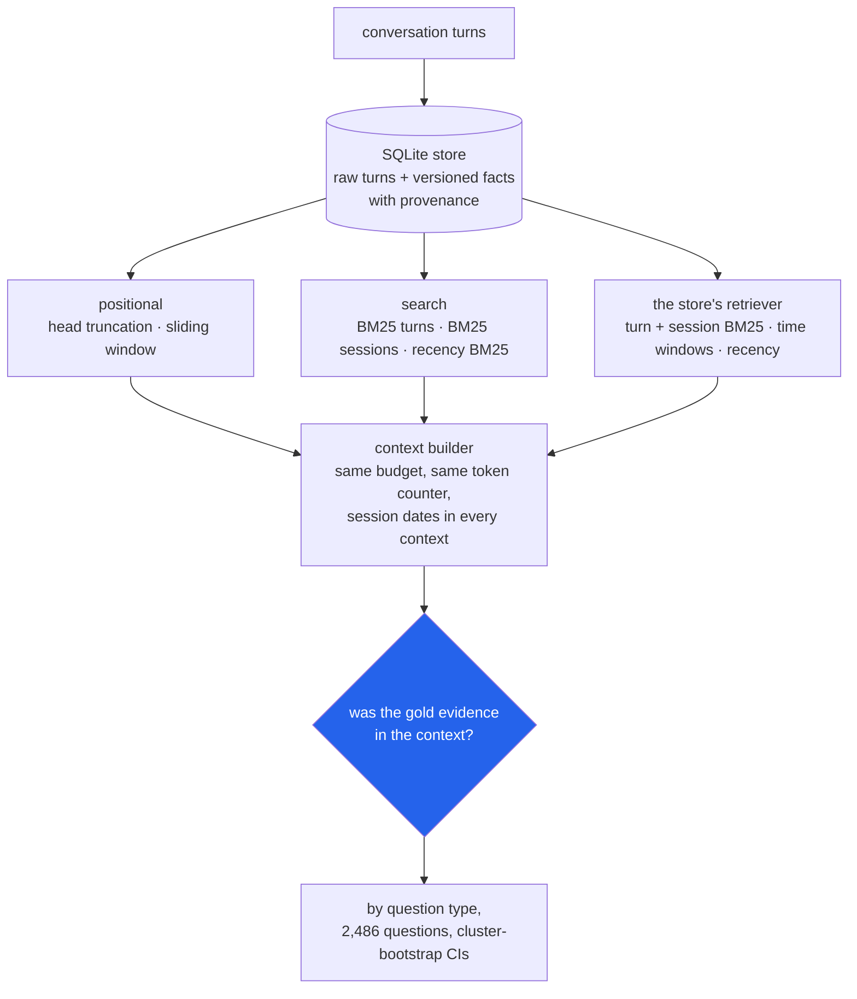

<h1 align="center">agent-memory (Python · SQLite · BM25 · Ollama)</h1>
<p align="center"><i>A cross-session memory layer for agents, and a measurement of what "remember everything and search" actually finds, question type by question type</i></p>

<p align="center">
  <a href="#the-through-line">The through-line</a> &middot;
  <a href="#findings">Findings</a> &middot;
  <a href="#input--output">Input / Output</a> &middot;
  <a href="#quick-start">Quick start</a> &middot;
  <a href="#what-this-does-not-do">What it does NOT do</a> &middot;
  <a href="#problems-hit-while-building-this">Problems hit</a>
</p>

<p align="center">
  
  
  
  
  <a href="LICENSE"></a>
</p>

Inspired by [claude-mem](https://github.com/thedotmack/claude-mem), [mem0](https://github.com/mem0ai/mem0) and [supermemory](https://github.com/supermemoryai/supermemory); no code from them is used.

---

## The through-line



The library is a memory store for agents: ingest conversation turns, keep every raw turn
with its timestamp, file extracted facts as versioned `(subject, attribute, value)` rows
where a newer value supersedes the old one without deleting it, answer "what was true on
date X", retrieve with BM25 written from scratch, and build a context that fits a token
budget. The study puts eight memory strategies through the same context builder on two
benchmarks with gold evidence labels - LoCoMo (10 conversations, 1,986 questions) and
LongMemEval_S (500 questions, each with its own ~112k-token chat history) - and asks
whether the evidence a question needs made it into a 2,048-token context.

> **Searching everything beats recency by 67-79 recall points at 2,048 tokens, and a
> sliding window is no better than random turns - because on both benchmarks the evidence
> sits uniformly through the history, not near the end. What retrieval structurally loses
> is not "old" information but information spread across turns (multi-hop: every piece of
> evidence found for only 34% / 50% of questions) or never named by the question
> (open-domain inference: 42% of its evidence turns share no content word with it).
> Temporal questions are found (86% / 81%) but 71% of LoCoMo's answers are dates the
> evidence turn never states, so a memory that drops session timestamps loses them anyway.**

The model arm - LLM fact extraction, `nomic-embed-text` hybrid retrieval, and answer
accuracy with `qwen2.5:14b-instruct` - is built, tested with fakes, and queued; none of
the numbers below needed a model. See [STATUS.md](STATUS.md).

## Findings

All numbers are on the **test split** (80% of the data; LoCoMo split by conversation,
LongMemEval by question), at a **2,048-token** context, with 95% cluster-bootstrap
intervals (LoCoMo resamples its 7 test conversations, not questions, so its intervals are
honest about having only 7 independent histories). Every number comes from
[`results/`](results/).

| | Question | Answer on this run | Source |
|---|---|---|---|
| 1 | **Does remembering everything and searching beat recency?** | Yes, by a mile: BM25 over turns minus a sliding window is **+0.67** recall [0.65, 0.70] on LoCoMo and **+0.79** [0.75, 0.83] on LongMemEval. The window is statistically indistinguishable from random turns on LoCoMo (+0.018 [-0.001, 0.035]) and *worse* than random on LongMemEval (-0.023 [-0.039, -0.007]). | `retrieval.json` → `comparisons` |
| 2 | **Why does recency lose so badly?** | The evidence is not recent. Its mean position in the history is 0.50 (LoCoMo) and 0.54 (LongMemEval), where 1.0 is the last turn; only 9.5% and 6.7% of evidence sits in the newest tenth. That is a property of the benchmarks - an agent whose questions really are about the last hour would see the opposite. | `diagnostics.json` → `evidence_position` |
| 3 | **Which question types does retrieval structurally lose?** | Multi-hop and inference. The store's recall is 0.91 single-hop / 0.60 multi-hop / 0.45 open-domain on LoCoMo; 0.95 single-hop / 0.68 multi-hop / 0.63 preference on LongMemEval. For multi-hop, *all* evidence arrives for only **34%** [22, 43] and **50%** [41, 60]. Open-domain questions ("would Caroline likely...") are lexically invisible: **42%** of their evidence turns share no content word with the question. | `retrieval.json` → `by_budget`; `diagnostics.json` → `lexical_visibility` |
| 4 | **Are temporal questions lost?** | Not at retrieval: 0.86 [0.80, 0.92] and 0.81 [0.74, 0.88]. But **71%** of LoCoMo temporal answers are dates the evidence text never states ("I went to a support group *yesterday*" → gold "7 May 2023"); they are recoverable only because the context builder heads each session with its date. | `diagnostics.json` → `answer_location` |
| 5 | **Knowledge updates: does search return the stale value?** | With BM25 over turns at 2,048 tokens, rarely - the newest value's session is in context for **92%** of update questions and only the stale one for 4.9%. At 512 tokens the stale-only rate is **16.4%**. A 30-day recency half-life cuts that to 6.6% and raises newest-value recall by 6.6 points [0.0, 14.8] - while costing LoCoMo 28 recall points at the same budget (0.61 → 0.32). The dev sweep chose a 5-year half-life: effectively off. | `recency_sensitivity.json` |
| 6 | **What does the store's retriever add over plain BM25?** | +0.071 [0.057, 0.083] on LoCoMo, +0.021 [0.005, 0.039] on LongMemEval. The ablations say almost all of it is **session-level fusion** (+0.068 / +0.022). Recency decay adds nothing measurable (+0.001 / +0.000). The time-window boost adds +0.004 overall because only 0-22% of questions (by type) name a time at all; on the questions that do it is +0.063 [0.024, 0.100] on LoCoMo and -0.020 [-0.060, 0.000] on LongMemEval. | `retrieval.json` → `comparisons`, `time_expression_questions` |
| 7 | **Recall@k flatters coarse units** | BM25 over whole sessions reaches recall@10 of **0.96** on LongMemEval - at a mean of 29,381 tokens. At an equal 2,048-token budget it is **15 points worse** than BM25 over turns (-0.150 [-0.189, -0.110]). On LoCoMo, where sessions are short, sessions win by 0.022. | `retrieval.json` → `by_k`, `comparisons` |
| 8 | **Forgetting: what can be thrown away?** | Truncating every turn to 128 tokens keeps 37% of LongMemEval's stored tokens, drops no evidence turn, and *raises* recall at 2,048 tokens from 0.82 to 0.89 (cheaper turns, more of them fit) - but the literal gold answer survives the cut in 95% of cases, not 100%. Dropping every assistant turn keeps 13% of the tokens and leaves the overall average almost unchanged (0.813 vs 0.819) - by swapping types: multi-hop rises 0.68 → 0.88 while assistant-side questions collapse 0.93 → 0.09. The average hides the swap. | `forgetting.json` |

Two things the headline is not:

- **Not answer accuracy.** Evidence in context is necessary, not sufficient; whether
  `qwen2.5:14b-instruct` answers correctly from it is the queued model arm. What the
  retrieval study can say without a model, it says above.
- **Not a tuned leaderboard number.** The store's four knobs were chosen on the dev split
  only ([`results/dev_sweep.json`](results/dev_sweep.json), 72 configurations). On the dev
  split the winner is slightly worse than dropping session fusion on LongMemEval
  (0.875 vs 0.889) and much better on LoCoMo (0.839 vs 0.735); it was chosen on the macro
  average. Dev-split numbers for every strategy are in `retrieval.json`.

Full budget curves (256 to 8,192 tokens), recall@k, and the `all`/`newest`/`stale_only`
metrics for every strategy and type are in `results/retrieval.json`; per-question rows are
in `results/rows/*.jsonl.gz`.

## Input / Output

`uv run python demo.py` - real output, unedited.

**1. A store with known answers** (a lookup, a time-scoped question, a fact that changes,
a forgetting pass):

```
PART 1 - a store with known answers
  ingested 8 turns from 4 sessions
  [ok  ] search 'what is my dog called?': 'jan:1'
  context 'where did I say I work, back in March?' (60-token budget):
      [session mar - 2024-03-05 18:00 (Tuesday)]
      user: Work at Riverside Hospital is exhausting, twelve-hour nursing shifts.
      assistant: That sounds demanding - make sure you rest.
  [ok  ] the March turn is first in context: 'mar:0'
  [ok  ] tokens used <= budget: True
  [ok  ] current employer: "St Mary's clinic"
  [ok  ] employer as of 2024-04-01: 'Riverside Hospital'
  [ok  ] old value kept, marked superseded: 2
  [ok  ] forget phatic turns ('Hi!', 'ok thanks'): 2
  stats: {'sessions': 4, 'turns': 6, 'forgotten_turns': 2, 'facts_current': 1, 'facts_superseded': 1}
```

**2. A LoCoMo temporal question** - found by search, invisible to the window, and
answerable only through the session date (the turn says "yesterday"):

```
  [locomo / temporal] When did Caroline go to the LGBTQ support group?
  gold answer: 7 May 2023
  gold evidence conv-26:D1:3 (08 May 2023) Caroline: I went to a LGBTQ support group yesterday and it was so powerful.
    sliding_window   2033 tokens, evidence 0/1
    bm25_turns       2045 tokens, evidence 1/1
    store            2041 tokens, evidence 1/1
```

**3. A LoCoMo multi-hop question** - the structural loss. Four activities in four turns
across three sessions; the question's words ("activities", "partake") appear in none of
them, so every strategy finds one:

```
  [locomo / multi-hop] What activities does Melanie partake in?
  gold answer: pottery, camping, painting, swimming
  gold evidence conv-26:D1:12 (08 May 2023) Melanie: You'd be a great counselor! Your empathy and understanding will really help the people you
  gold evidence conv-26:D1:18 (08 May 2023) Melanie: Yep, Caroline. Taking care of ourselves is vital. I'm off to go swimming with the kids. Ta
  gold evidence conv-26:D5:4 (03 Jul 2023) Melanie: Wow, Caroline! That's great! I just signed up for a pottery class yesterday. It's like the
  gold evidence conv-26:D9:1 (17 Jul 2023) Melanie: Hey Caroline, hope all's good! I had a quiet weekend after we went camping with my fam two
    sliding_window   2033 tokens, evidence 0/4
    bm25_turns       2038 tokens, evidence 1/4
    store            2034 tokens, evidence 1/4
```

**4. A LoCoMo adversarial (abstention) question** - it pins Melanie's charity race on
Caroline. The gold answer is "not answerable"; the evidence is the turn that shows whose
race it was:

```
  [locomo / abstention] What did Caroline realize after her charity race?
  gold answer: Not answerable - the conversation does not say this about them (the trap answer would be: self-care is important)
  gold evidence conv-26:D2:3 (25 May 2023) Melanie: Thanks, Caroline! The event was really thought-provoking. I'm starting to realize that sel
    sliding_window   2033 tokens, evidence 0/1
    bm25_turns       2037 tokens, evidence 1/1
    store            2043 tokens, evidence 1/1
```

**5. A LongMemEval knowledge-update question** (the first in the file) - the personal best
changed a week later; both sessions are found, including the newest value:

```
  [longmemeval / knowledge-update] What was my personal best time in the charity 5K run?
  gold answer: 25 minutes and 50 seconds (or 25:50)
  gold evidence 6a1eabeb:answer_a25d4a91_1:4 (23 May 2023) user: That's really helpful, thanks! I've been doing some running lately, and I'm happy to say t
  gold evidence 6a1eabeb:answer_a25d4a91_2:0 (30 May 2023) user: I'm training for another charity 5K run coming up and I was wondering if you could give me
    sliding_window   1675 tokens, evidence 0/2, newest value found: False
    bm25_turns       2034 tokens, evidence 2/2, newest value found: True
    store            2042 tokens, evidence 2/2, newest value found: True
```

**6. The CLI on a real LoCoMo conversation** - ingest, search, a time-scoped context,
versioned facts:

```
$ agent-memory --db cli.db ingest --format locomo --pick conv-30 data/raw/locomo10.json
ingested 369 new turns (0 already stored) from 19 sessions

$ agent-memory --db cli.db search "opening a dance studio" -k 2 --now 2023-07-01
2023-06-19 10:04  conv-30:D15:3  Jon: Thanks, Gina. Still working on opening a dance studio.
2023-05-11 15:14  conv-30:D11:2  Gina: Hi! You're so inspiring taking it on and opening your own studio!

$ agent-memory --db cli.db context "what did Jon say about his dance studio in June 2023?" --budget 200 --now 2023-07-25
[session conv-30:S8 - 2023-04-03 13:26 (Monday)]
Jon: Gina, good luck with your store! [shares a photo: a photo of a dress with a sign on it that says june bunty]
[session conv-30:S13 - 2023-06-13 20:29 (Tuesday)]
Jon:  I'm prepping for my dance studio more than ever!
[session conv-30:S15 - 2023-06-19 10:04 (Monday)]
Jon: Thanks, Gina. Still working on opening a dance studio.
[session conv-30:S16 - 2023-06-21 14:15 (Wednesday)]
Gina: No worries, Jon! When things get rough, keep persevering and keep working hard. You'll get there! Don't quit! [shares a photo: a photo of a sign that says never give up never give up never]

-- 198 of 200 tokens, 4 turns, 0 facts

$ agent-memory --db f.db remember jon job "banker" --at 2022-06-01
fact #1: jon / job: banker (since 2022-06-01)
$ agent-memory --db f.db remember jon job "none - lost the banker job, starting a business" --at 2023-01-19 --source conv-30:D1:2
fact #2: jon / job: none - lost the banker job, starting a business (since 2023-01-19)
$ agent-memory --db f.db history jon job
#1  2022-06-01  banker  [superseded by #2]
#2  2023-01-19  none - lost the banker job, starting a business  [current]  from conv-30:D1:2
$ agent-memory --db f.db facts --as-of 2022-12-01
#1  jon / job: banker (since 2022-06-01)
```

*The April turn in the context is a lexical false positive worth seeing: its photo caption
contains the word "june". The three June turns are there because the question names June
and the window boost doubled their scores.* (The banker start date is illustrative; the
conversation only says he lost the job the day before 20 January 2023.)

## Quick start

```bash
git clone <this repo> && cd agent-memory
uv sync
uv run pytest -q                                   # 96 tests, no data, no network, no model
uv run python demo.py                              # part 1 needs nothing
uv run python scripts/fetch_data.py                # LoCoMo + LongMemEval oracle & S (~295 MB)
uv run python demo.py                              # now with part 2
uv run python scripts/run_retrieval_study.py       # every results/*.json (~40 min, 1 core)
bash scripts/run_models.sh --dry-run               # the queued model arm: jobs and call counts
```

As a library:

```python
from datetime import datetime
from agent_memory.store import MemoryStore

with MemoryStore("memory.db") as m:
    m.add_turn("s1", "user", "I just adopted a beagle called Biscuit.", datetime(2024, 1, 10))
    m.remember("user", "dog", "Biscuit (beagle)", datetime(2024, 1, 10), source_turn="s1:0")
    ctx = m.context("what's my dog called?", budget=512)
    print(ctx.render(), ctx.tokens)
```

## Layout

```
src/agent_memory/
  store.py        SQLite: sessions, raw turns, versioned facts with provenance; forget/compact/purge
  bm25.py         Okapi BM25 from scratch (postings, non-negative idf)
  text.py         index terms (stop words, light stemmer) and a calibrated token counter
  temporal.py     dataset timestamps; "last month", "three weeks ago", "in May 2023" -> date windows
  retrieval.py    the eight strategies and the store's Retriever
  context.py      the context builder: packs units into a budget, one date header per session
  forget.py       forgetting (phatic, role, older-than) and compaction (truncate) policies
  datasets.py     LoCoMo and LongMemEval loaders; streaming JSON so 277 MB never sits in memory
  evaluate.py     evidence recall / all / newest / stale-only per question, strategy, budget, k
  stats.py        cluster bootstrap in plain Python
  report.py       summaries, paired differences, budget-to-reach
  analysis.py     lexical visibility, answer location, evidence position
  cli.py          the `agent-memory` command
  llm.py          model arm: Ollama client, SQLite call cache, deterministic fake
  embedding.py    model arm: nomic-embed-text dense index, RRF hybrid with the store retriever
  extract.py      model arm: LLM fact extraction into the store
  answer.py       model arm: answer from context, judge against gold per question type
scripts/
  fetch_data.py            parallel, resumable, sha256-verified byte-range download
  run_retrieval_study.py   diagnostics -> recency -> dev sweep -> main -> forgetting
  run_model_arm.py         dense/hybrid retrieval, extraction, answer accuracy (+ --dry-run)
  run_models.sh            RAM / GPU / Ollama checks, then the model arm
  calibrate_tokens.py      count_tokens vs tiktoken cl100k_base
results/                   every number in this README
```

## Requirements

Python 3.11+ and `uv`. **No runtime dependencies** - `sqlite3`, `urllib`, `json` and
`math` from the standard library. The retrieval study runs on one CPU core in under 2 GB
of RAM. The model arm needs Ollama with `qwen2.5:14b-instruct` and `nomic-embed-text` and
a GPU with ~11 GB free.

## Tests

```bash
uv run pytest -q     # 96 tests
uv run ruff check .
```

Tests use small fixture conversations, a deterministic fake LLM, and a stub HTTP server
standing in for Ollama - no data files, no network, no model. They pass with
`AGENT_MEMORY_DATA` pointed at an empty directory. They cover BM25 against a hand
computation, the token counter against recorded cl100k counts, every temporal phrase,
budget packing (never over budget, counts exactly what it renders), fact supersession
including a late-arriving older value, turn ids never reused after a purge, streaming JSON
across 1-byte chunk boundaries, the cluster bootstrap widening with correlated clusters,
the CLI's error messages, and the model client's resume-from-cache behaviour.

## What this does NOT do

- **It does not measure answer accuracy yet.** Evidence recall is an upper bound on what a
  reader can use; the answer-accuracy arm is built and queued, not run.
- **It does not extract facts without a model.** The versioned fact store is complete and
  tested, but facts come from `remember()` / the CLI or from the queued LLM extractor. No
  retrieval number above uses facts.
- **Its token counts are approximate.** `count_tokens` is calibrated against cl100k_base:
  4% over on LoCoMo, 10% over on LongMemEval (markdown and code in assistant turns).
  Every strategy is counted the same way, so comparisons at a budget are exact; absolute
  counts are not.
- **It does not model realistic recency.** Both benchmarks spread evidence uniformly; the
  "recency loses" result is about these benchmarks, and finding 2 says why.
- **LongMemEval abstention has almost no retrieval signal**: 21 of its 30 abstention
  questions have no evidence turns at all, and the test split holds 7 measurable ones.
  The 1.00 in `retrieval.json` for that cell is n=7, not a result.
- **It is not a vector database.** Dense retrieval exists only in the model arm.

## Problems hit while building this

- **Hugging Face ran at ~20 KB/s per connection.** A plain download of the 277 MB
  LongMemEval_S file would have taken hours. `scripts/fetch_data.py` splits it into 2 MB
  byte ranges fetched by 32 workers, each range in its own resumable part file, and accepts
  the assembled file only if its SHA-256 matches the LFS oid - about 35 minutes.
- **LoCoMo's adversarial questions have no gold answer field.** Category 5 carries
  `adversarial_answer`, which is the *trap* (the answer about the other speaker). A loader
  that falls back to it would grade "the model fell for it" as correct. The loader writes
  "not answerable" as the gold.
- **8 of LoCoMo's 2,815 evidence ids match no turn.** Six are malformed - `D:11:26`,
  `D30:05`, three space-separated lists like `D9:1 D4:4 D4:6`, a bare `D` - and two point
  past the end of their session. The first loader silently dropped all eight, leaving 8
  questions with nothing to find; a regex now normalises the malformed ones and 4
  questions remain unmeasurable (counted, and excluded from recall).
- **The diagnostics reported 103 LongMemEval histories, not 500.** Streaming frees each
  question's history, CPython reuses the object's `id()`, and a `seen` set keyed on
  `id(history)` treated new histories as old ones. Keyed on the question id now.
- **LongMemEval multi-session answers looked 77% "date-shaped".** They are counts ("3"),
  and the answer-location classifier treated any number as a day of the month. A bare count
  is no longer a date; the corrected figure is 1%.
- **A purged turn's id was handed to the next new turn.** Ids came from `MAX(seq) + 1`,
  so deleting the last turn of a session recycled its id - and any fact pointing at it
  would have pointed at the wrong text. Found by a test; sessions now carry a monotonic
  counter.
- **Every fact matched every question.** With the subject "user" on every fact, "user" in
  the query scored them all. Terms present in every fact are now ignored, and each fact is
  indexed together with the turn it came from, so "where do I work" finds an `employer`
  fact whose source turn says "I work at".
- **The first token counter was 32% high** against cl100k_base; recalibrated on all
  5,882 LoCoMo turns (`results/token_calibration.json`).
- **`json.load` on 277 MB** would cost well over a gigabyte; the loader decodes the array
  element by element from 4 MB chunks.

## Keywords

agent memory &middot; long-term memory &middot; conversational memory &middot; LoCoMo &middot; LongMemEval &middot; BM25 &middot; retrieval evaluation &middot; evidence recall &middot; context window budget &middot; temporal reasoning &middot; knowledge update &middot; fact supersession &middot; SQLite &middot; forgetting policy &middot; cluster bootstrap &middot; Ollama

## License

MIT
